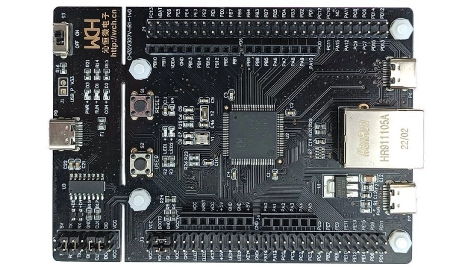

# CH32V307 评估板\CH32V307 Evaluation

Chip: **CH32V307VCT6** (CH32V30x_D8C, 288 KB flash / 64 KB RAM build used)

- Debug adapter: **WCH-Link** (wlink, RV mode)
- Debug serial: USART1 (PA9 TX), **115200 baud** (8N1) — all projects print
  here (`printf` retargeted in `drivers/SRC/Debug/debug.c`)

## Projects

All bare-metal projects live in the `bare/` folder and build from the command
line — no IDE needed.

| Project                       | Description                                                          |
|-------------------------------|----------------------------------------------------------------------|
| `bare/blink`                  | GPIO toggle (PA0) + chip ID / SysTick report over UART               |
| `bare/adc_temp_internal`      | Internal temperature sensor via ADC                                  |
| `bare/dhry_144m`              | Dhrystone 2.1 @ 144 MHz: 331,565 Dhrystones/s (1.310 DMIPS/MHz)      |
| `bare/coremark_144m`          | CoreMark 1.0 @ 144 MHz: 414.9 it/s                                   |
| `bare/WebServer`              | Ethernet web server (WCH net lib, 10M PHY)                           |

Shared code is **not** duplicated per project:

- `drivers/SRC/` (repo root) — Core / Debug / Peripheral library / Startup / `Ld/Link.ld`
  (288K flash + 32K RAM layout), referenced by all projects. The WCH example
  projects live next to it in `drivers/` and share the same `SRC` tree.
- `NetLib/` (this folder) — WCH Ethernet drivers + `libwchnet.a`, used by
  `bare/WebServer`.

## Building from the CLI

Each project ships a **Makefile** (GNU Make). Run from Git Bash / MSYS2, or
put the MounRiver bundled make on PATH:

```
C:\msys64\usr\bin\bash.exe
cd ch32v307evt/bare/<project>
make          # build build/<proj>.elf
make hex      # build build/<proj>.hex
make flash    # program build/<proj>.hex via WCH-Link (OpenOCD)
make size     # print section sizes
make clean    # remove build/
```

The Makefiles default to the **MounRiver Studio 2** bundled toolchain and
OpenOCD:

- Compiler: `<MRS2>\resources\app\resources\win32\components\WCH\Toolchain\RISC-V Embedded GCC15\bin\riscv32-wch-elf-gcc.exe`
- Flasher:  `<MRS2>\resources\app\resources\win32\components\WCH\OpenOCD\OpenOCD\bin\openocd.exe` with `wch-riscv.cfg`

where `<MRS2>` is `D:\MounRiver\MounRiver_Studio2` by default; override with
`make MRS2=...` (or `RISCV_GCC=`/`OPENOCD=`/`OPENOCD_CFG=` for individual
tools). `make flash` runs `openocd -f wch-riscv.cfg -c "program <hex> verify
reset exit"`, which erases, writes, verifies and resets the chip.

To view the serial output: WCH-Link exposes a CDC serial port
("WCH-Link SERIAL", e.g. COM30) — open it at **115200**.

Yes, the boards can be flashed fully from the CLI: build + program + verify +
reset need nothing but `make flash` and a WCH-Link probe.

## How to add a project

1. Copy an existing project folder in `bare/` to a new name.
2. Edit `User/main.c` for your application.
3. In the new `Makefile` change `PROJ :=` (and the flag block if needed).
   Sources are picked up by wildcard from `User/`, plus the shared
   `drivers/SRC/` tree.

The leftover `.cproject` / `.project` / `.mrs` files only matter for the
optional MounRiver Studio IDE import; the CLI workflow does not use them.

## Board


